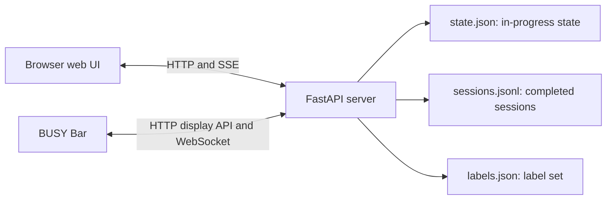
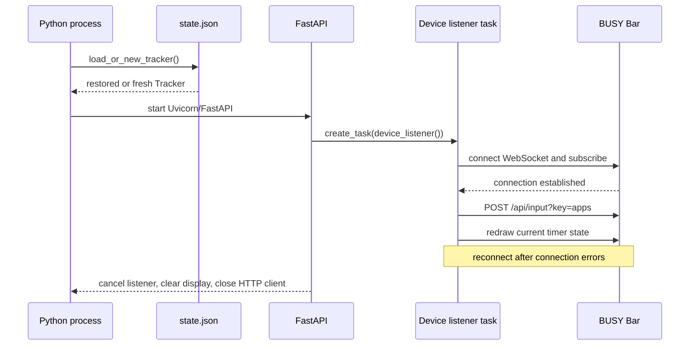
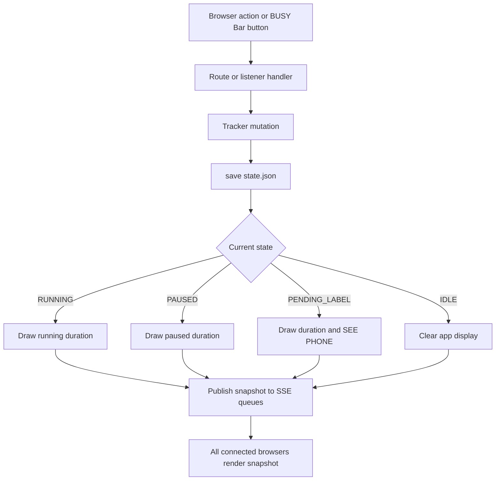
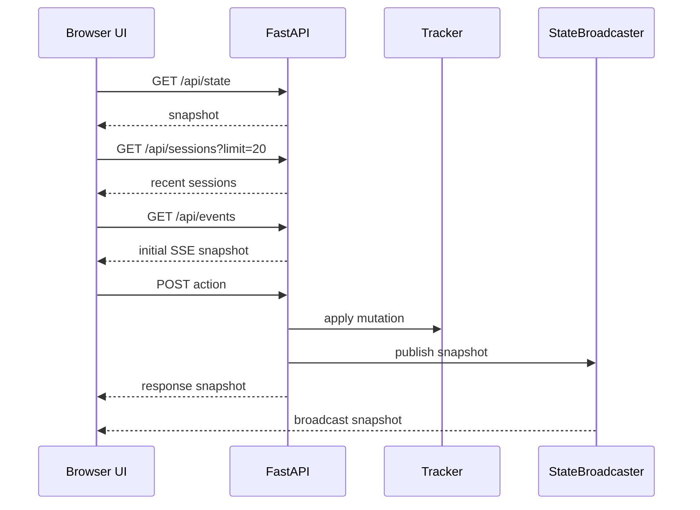
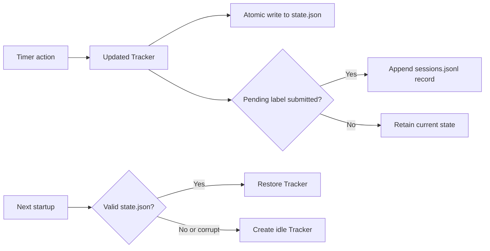

# AdvancedTimer Architecture

## Purpose

AdvancedTimer is a local-network time tracker controlled through a BUSY Bar or a
browser. Both surfaces mutate one shared timer in one Python process. The server
persists current state after each action, appends completed sessions, and keeps
the BUSY Bar display synchronized when the device is available.

There is no database, user account system, or authentication. The intended
deployment is one process on a trusted local network.

## System Context



The browser and BUSY Bar are equivalent timer controls. Either can start,
pause, resume, stop, select a label for, or file a session. The browser-only
actions are the ones that need a keyboard: creating a label, and writing a
session's description. The bar picks from the existing label set with its scroll
wheel and never displays the description.

## Components

| Component | Source | Responsibility |
| --- | --- | --- |
| FastAPI server | `app/server.py` | Application entry point, HTTP and SSE endpoints, lifecycle management, and mutation coordination. |
| Tracker | `app/tracker_core.py` | Pure timer state machine; owns transitions, active segments, snapshots, and session records. |
| BUSY Bar client | `app/busybar_client.py` | Async HTTP display client and reconnecting WebSocket button-event stream. |
| State store | `app/state_store.py` | Best-effort atomic persistence and recovery of the current tracker. |
| Sessions store | `app/sessions_store.py` | Append-only JSON Lines storage; newest-first capped reads, and an uncapped oldest-first read for the stats page. |
| Labels store | `app/labels_store.py` | The label set in `labels.json`: forgiving parse, mtime-cached reads, add/delete. |
| Atomic IO | `app/atomic_io.py` | Shared tmp-file/fsync/rename JSON write used by the state and label stores. |
| State broadcaster | `app/broadcaster.py` | In-process fan-out of state snapshots to Server-Sent Event subscribers. |
| Browser UI | `app/static/index.html` | Static single-page UI with controls, live elapsed-time rendering, and history. |
| Stats page | `app/static/stats.html` | Static page reviewing history: a day/week/month stacked bar chart of time by label, client-side aggregated. |
| Configuration | `app/config.py` | Loads `.env` and environment variables; provides device, web, and storage settings. |

`server.py` creates one `Tracker`, `BusyBarClient`, and `StateBroadcaster` at
module import. Requests and the device listener share these singletons; run
exactly one worker and do not use Uvicorn autoreload.

## Startup and Shutdown

Start the server with:

```sh
python -m app.server
```

At import, `load_or_new_tracker()` restores `state.json` when valid or creates a
fresh idle tracker. FastAPI lifespan then starts `device_listener()` as a
background asyncio task. HTTP requests, SSE streams, and the listener all run
on one asyncio event loop.



Two recovery loops protect the device connection. `button_events()` retries
WebSocket or socket errors after two seconds. The outer `device_listener()` also
restarts an unexpected exception or clean return after two seconds, preventing a
tight loop.

The HTTP web app starts even when the BUSY Bar is offline. The listener retries
in the background; browser actions and storage remain usable. Device buttons
and display synchronization resume after a successful reconnect.

## Timer State Machine

The tracker has four states: `IDLE`, `RUNNING`, `PAUSED`, and `PENDING_LABEL`.
Completed active segments and an open running segment are stored separately, so
paused time does not contribute to active duration.

```mermaid
stateDiagram-v2
		[*] --> IDLE
		IDLE --> RUNNING: start-toggle
		RUNNING --> PAUSED: start-toggle; close segment
		PAUSED --> RUNNING: start-toggle; begin segment
		RUNNING --> PENDING_LABEL: stop; close segment
		PAUSED --> PENDING_LABEL: stop
		PENDING_LABEL --> IDLE: submit label, skip, or bar OK
		PENDING_LABEL --> RUNNING: start-toggle; file selected label, start new
		IDLE --> IDLE: stop: no-op
		PENDING_LABEL --> PENDING_LABEL: stop: no-op
```



The scroll wheel changes `selected_label` without changing state, so it is a
self-transition available in all four states.

### State Contracts

`state.json` stores the internal tracker form using Unix timestamps:

```json
{
	"app_state": "PAUSED",
	"session_start": 1788078247.047779,
	"segments": [{"start_ts": 1788078247.047779, "end_ts": 1788078253.5913842}],
	"current_segment_start": null,
	"accumulated": 6.543605089187622,
	"pending": null,
	"selected_label": "Coding",
	"selected_description": "Reworked the label manager"
}
```

`selected_label` and `selected_description` are the metadata armed for the current
session. Both are read with a default, so a `state.json` written before either
field existed still resumes. Because the description is persisted on every
keystroke batch, `tracker_core.MAX_DESCRIPTION_CHARS` (500) bounds its length.

The public API snapshot uses UTC ISO-8601 timestamps:

```json
{
	"state": "RUNNING",
	"session_start": "2026-08-30T12:00:00Z",
	"current_segment_start": "2026-08-30T12:00:00Z",
	"accumulated_seconds": 0.0,
	"selected_label": "Coding",
	"selected_description": "Reworked the label manager",
	"labels": [{"name": "Coding", "color": "#3DD68CFF"}]
}
```

`labels` is attached by `server.full_snapshot()` rather than by the tracker, which
stays I/O-free. Shipping it inside every snapshot means the existing SSE stream
already fans label edits out to every open browser, with no second event channel.

For `PENDING_LABEL`, the snapshot additionally exposes `pending.session_start`,
`pending.end`, `pending.total_active_seconds`, and finalized segments. The
device count-up display uses `current_segment_start - accumulated` as a virtual
start timestamp, preserving active duration across resumes.

## Shared Mutation Flow

All accepted browser and device controls use the same path.



`apply_and_broadcast()` mutates, saves, redraws, and then publishes. The save
precedes device I/O, so unavailable hardware cannot prevent a state update from
being persisted. Completing a pending label appends the session record before
the tracker resets to `IDLE`.

`apply_and_publish()` is the same path without the redraw, for state the bar does
not render. Only the description uses it: it is typed, so it fires repeatedly, and
routing it through `apply_and_broadcast()` would put an HTTP draw on the device
behind every keystroke batch for something the bar never shows.

## Browser Application and API

The static UI requests state and sessions at load, subscribes to SSE, and posts
actions. No build system or client-side framework is used.

| Endpoint | Method | Request | Response and behavior |
| --- | --- | --- | --- |
| `/` | `GET` | None | Serves the browser application. |
| `/stats` | `GET` | None | Serves the stats page (see below). |
| `/api/state` | `GET` | None | Returns the current snapshot. |
| `/api/actions/start-toggle` | `POST` | None | Starts, pauses, resumes, or finalizes a pending session under the selected label before starting a new one. |
| `/api/actions/stop` | `POST` | None | Stops running or paused work and enters label mode; otherwise no-op. |
| `/api/actions/label` | `POST` | `{"label": "...", "description": "..."}` | Finalizes a pending session and returns to idle. Both fields may be empty. |
| `/api/actions/select-label` | `POST` | `{"label": "Coding"}` | Arms a label for the current/next session. The web mirror of the scroll wheel. |
| `/api/actions/select-description` | `POST` | `{"description": "..."}` | Arms the session's free-text note. Publishes without redrawing the bar. |
| `/api/labels` | `GET` | None | Returns the ordered label set. |
| `/api/labels` | `POST` | `{"name", "color"}` | Adds a label; ignores case-insensitive duplicates. |
| `/api/labels?name=X` | `DELETE` | `name` query param | Removes a label, clearing the selection if it was the one selected. |
| `/api/sessions?limit=20` | `GET` | Optional `limit`, default `20` | Returns newest completed sessions first. |
| `/api/sessions/all` | `GET` | None | Returns every completed session, oldest first, uncapped. Used only by the stats page. |
| `/api/events` | `GET` | None | Opens an SSE stream with an immediate snapshot plus later mutations. |



While running, the browser updates its elapsed display every 250 ms from the
last authoritative snapshot. In label mode it hides normal controls and shows
the save/skip row. It reloads recent sessions when the pending-label state ends.

A label dropdown and a description field are visible in every state, so a session's
metadata can be set before it starts or while it runs. The dropdown stays in sync
with the bar's wheel through the same SSE snapshots. The description posts on a
~400 ms debounce (and on blur), and an incoming snapshot only writes into the field
when it is not focused - otherwise a broadcast landing mid-keystroke would eat the
character just typed. Save sends the label and description together rather than
relying on the debounced call having landed; Skip sends an empty label but keeps
the description, since silently discarding text the user just typed would be worse
than filing the session unlabeled.

Label management lives in a collapsed `<details>` disclosure, placed directly under
the controls and above the session list. Rendering every label inline was what
pushed the session list off-screen once the label set grew - collapsing them fixed
that, not moving them, since a collapsed disclosure is only ~32px tall wherever it
sits. Below the session list it ended up ~1300px down the page once sessions
carried descriptions, out of reach on a phone; above it, it costs one row and stays
above the fold at any list length, adjacent to the picker it configures. Expanding
it pushes the session list down, which is transient and user-initiated. The native
element carries its own keyboard and screen-reader behavior, so no focus management
is needed, and its summary wraps an `<h2>` so both sections appear in the heading
outline.

The page targets WCAG 2.2 AA: every control has an associated `<label>` (visually
hidden where the layout has no room for visible text), delete buttons carry
`aria-label="Delete label <name>"` and meet the 24x24 target minimum, the state
line is a `role="status"` live region, color dots are `aria-hidden` decoration
beside a text name, and all text pairs clear 4.5:1 against the `#111` background.
The elapsed readout is deliberately *not* in a live region - it repaints four times
a second and would flood a screen reader.

### Stats Page

`app/static/stats.html` is a second, independent static page (same no-build-step,
inline-CSS/JS convention as `index.html`) for reviewing history: time spent per
label, broken down by day, week, or month. It is a pure read-over-history view -
it introduces no new stored data, and does not subscribe to `/api/events`; it
fetches `/api/sessions/all` and `/api/labels` once on load and does all
aggregation client-side, matching the app's existing thin-server/smart-client
split (the server does no bucketing math of its own, same as `/api/state`'s
snapshot requiring no aggregation).

**Segment-level bucketing.** A session's segments can span many real days (a
session can be paused and resumed days later without being stopped). Bucketing by
*session* start, the way `total_seconds_today()` does for the bar's home screen,
would misattribute that time on a history chart. The stats page instead flattens
every session into per-segment rows and buckets **each segment's own start
timestamp** into a local calendar day/week (Monday-start)/month - a segment that
itself straddles local midnight is not further split; that precision doesn't
matter at this granularity, and the added complexity isn't worth it. Both
simplifications are documented in `stats.html`'s own comments, mirroring how
`total_seconds_today()` documents its.

**Timezone**: bucketing uses the browser's local timezone (via JS `Date`), not
the server's - a deliberate, documented assumption that browser and server are
effectively always the same machine for this single-user, LAN-only app.

**Layout gotcha**: `#content` (the section wrapping everything below the
heading, toggled via `[hidden]` for the empty-history state) must itself be
`display:flex; flex-direction:column; align-items:center; width:100%` - the
same rule `main` uses. A plain, unstyled `<div>` as a flex item of a
non-`stretch` flex container sizes to fit its content rather than filling the
available width, so every child inside it (each written as `width:100%;
max-width:760px`, expecting to fill *some* real container) silently collapsed
to a much narrower, content-driven width instead. Any future wrapper div added
inside `main` needs the same treatment, or it will quietly re-shrink everything
inside it the same way.

**Chart**: a hand-rolled SVG stacked bar chart (no library), one bar per bucket
in a fixed-size window (7 days / 6 weeks / 6 months) that pages via prev/next
controls, reset to the window containing today whenever granularity changes. To
keep a single stacked bar legible, the chart caps itself at the **top 6 labels by
time in the currently-viewed range**, plus a separate "(no label)" segment
(never folded) and a folded "(Other)" segment for the remainder - the breakdown
list and the table-view fallback are never capped, since a scrollable list has no
equivalent readability ceiling. A custom-styled tooltip (not the native browser
one) shows on hover; keyboard access to every value is via the always-reachable,
uncapped table view rather than making each stacked segment its own tab stop.

## BUSY Bar Integration
On each successful WebSocket connection, the client sends `{"enable": true}`,
forces apps mode, and redraws from the tracker. This restores device state after
a device reboot or power loss.

Button press events cause mutations: `START` maps to `toggle_start` and `OK` maps
to `ok_press`, which stops a running session or files a pending one under the
selected label. Scroll-wheel (`EncoderEvent`) messages move that selection through
`labels_store.selection_names()`. Releases, `BACK`, unrelated updates, malformed
messages, and stale replayed events are ignored. A message older than
`MAX_EVENT_AGE_MS` (2,000 ms) is considered reconnect backlog rather than live
input - this also stops a reconnect's replayed wheel events from spinning the
selection.

Each detent updates and persists the selection immediately, but the redraw is
debounced by `ENCODER_REDRAW_DEBOUNCE_S` (150 ms), so a fast scroll produces one
display draw rather than one per click.

The display uses one visual grammar across states: a 3px spine down the left edge
of the 72x16 front display carries the selected label's color, above two text
rows; the 160x80 grayscale back display repeats the same information larger.
Content on the back stops at x=136 because the firmware paints its own status
icons down the right edge. A `countdown` element has no `font` field, so the live
timer renders at the firmware's fixed size rather than matching the `extra_large`
text used for static durations.

Display HTTP calls time out after two seconds. Errors are logged or ignored, so
device I/O is best-effort. An offline device may delay a web action while its
display calls time out, but cannot make the timer or web API unavailable.

## Storage and Recovery



`save_state()` writes JSON to a sibling temporary file, flushes and `fsync`s it,
then atomically replaces `state.json`. Write failures are logged but non-fatal.
A missing or corrupt state file creates a fresh tracker on startup. For a running
session, downtime is counted as active time because the current segment start is
retained. Delete `state.json` to discard a resumable session.

Final sessions are appended to `sessions.jsonl`, one JSON record per line:

```json
{
	"session_id": "2026-08-30T12:00:00Z",
	"start": "2026-08-30T12:00:00Z",
	"end": "2026-08-30T12:05:00Z",
	"total_active_seconds": 180,
	"label": "focused work",
	"description": "drafted the migration plan",
	"segments": [
		{
			"start": "2026-08-30T12:00:00Z",
			"end": "2026-08-30T12:03:00Z",
			"duration_seconds": 180
		}
	]
}
```

Reads load the requested tail and reverse it so the newest records come first.
There is no retention policy, file locking, schema migration, or recovery from a
malformed completed-session record. Since there is no migration, records written
by older builds simply lack the newer keys - readers must treat `description` (and
`label` before it) as optional and default to `""`.

## Configuration and Operations

`app/config.py` reads a repository-root `.env`; shell environment variables
win. Lines accept comments and `KEY=value` values with optional quotes.

| Setting | Default | Meaning |
| --- | --- | --- |
| `BUSY_BAR_IP` | `10.0.4.20` | Device address used to build API and WebSocket URLs. |
| `WEB_HOST` | `0.0.0.0` | Server bind host. |
| `WEB_PORT` | `8765` | Server bind port. |
| `APP_NAME` | `time_tracker` | BUSY Bar display application name. |
| `PRIORITY` | `90` | BUSY Bar display priority. |
| `MAX_EVENT_AGE_MS` | `2000` | Maximum accepted button-event age. |
| `LOG_PATH` | `<repo>/sessions.jsonl` | Completed-session log. |
| `STATE_PATH` | `<repo>/state.json` | In-progress tracker state. |

The launchd template at `packaging/com.advancedtimer.server.plist` runs
`python -m app.server` with `RunAtLoad` and `KeepAlive`. Copy it to the user's
LaunchAgents directory, replace the Python, repository, and log placeholders,
and create the specified log directory before loading it.

Operational constraints:

- No authentication exists; any device that can reach the LAN address can control the timer.
- Run a single worker and process to preserve coherent shared in-memory state.
- `state.json` and `sessions.jsonl` contain personal activity timing data and should stay out of Git.
- Restrict `WEB_HOST` when the service must not be reachable on the whole LAN.

## Tests

Run the suite with:

```sh
python -m pip install -r requirements-dev.txt
python -m pytest
```

| Test area | Test file | Covered behavior |
| --- | --- | --- |
| Timer state machine | `tests/test_tracker_core.py` | Transitions, active-time accounting, snapshots, records, serialization, and label/description selection. |
| Current-state recovery | `tests/test_state_store.py` | Atomic write behavior, restore paths, corrupt and missing-state fallback. |
| Completed-session log | `tests/test_sessions_store.py` | JSONL append, newest-first capped reads, and uncapped oldest-first reads for the stats page. |
| Label set | `tests/test_labels_store.py` | Seeding, forgiving parse of hand edits, color normalization, add/delete. |
| Web API | `tests/test_server_api.py` | Routes and start, pause, resume, stop, label, select-label, label CRUD, force-skip, the stats page route, and `/api/sessions/all`. |
| Listener supervision | `tests/test_device_listener.py` | Restart and backoff after errors and unexpected returns; encoder handling and redraw debouncing. |

Tests use temporary storage and mock BUSY Bar I/O, so a physical device is not
needed for validation. There is no JS test infrastructure; `index.html` and
`stats.html`'s client-side logic (including all of the stats page's bucketing,
chart rendering, and folding behavior) is verified manually in a browser.

The server talks to the configured BUSY Bar through HTTP and a WebSocket status
stream. Display operations identify this application as `time_tracker` with
priority `90`.

| Interface | Operation                                                | Purpose                              |
| --------- | -------------------------------------------------------- | ------------------------------------ |
| HTTP      | `POST /api/input?key=apps`                               | Forces apps mode.                    |
| HTTP      | `POST /api/display/draw`                                 | Draws timer display elements.        |
| HTTP      | `DELETE /api/display/draw?application_name=time_tracker` | Removes this app's display elements. |
| WebSocket | `ws://<BUSY_BAR_IP>/api/status/ws`                       | Receives protobuf status updates.    |